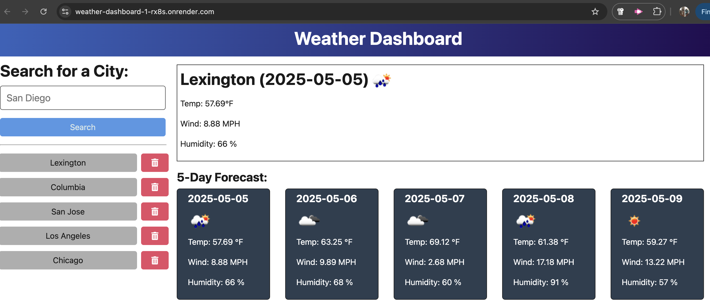

# API Weather Dashboard

## Introduction
This is a weather dashboard application that calls the OpenWeather API and renders data in the browser. It will use the 5-day weather forecast API to retrieve weather data for cities. The completed application is then deployed to Render.

For more information on how to work with the OpenWeather API, refer to the Full-Stack Blog on how to use API keys.

## Technologies
- JavaScript
- TypeScript
- Node.js
- OpenWeather API (5-day weather)
- Render

## Links
- [GitHub Repo](https://github.com/deetsb/weather-dashboard)
- [Render](https://weather-dashboard-1-rx8s.onrender.com)

## Credit
Tutoring session with Alexis Javier.

## Questions
Should you have questions, please reach me via:
- GitHub: [deetsb](https://github.com/deetsb)
- E-mail: [aditya.a.bhonsle@gmail.com](mailto:aditya.a.bhonsle@gmail.com)
